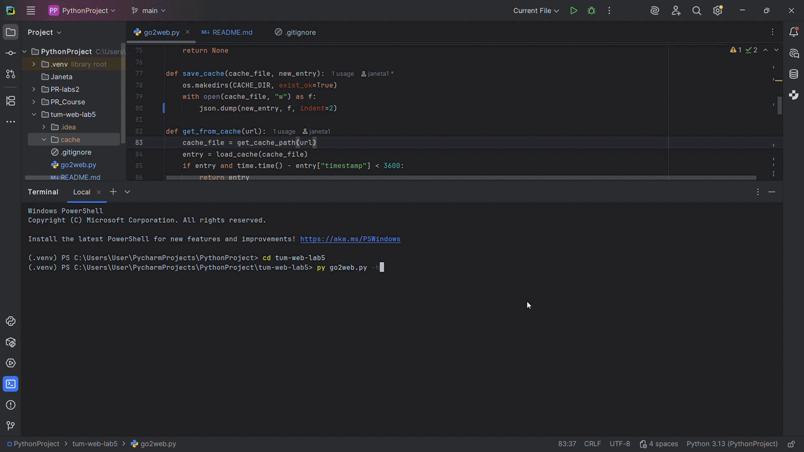
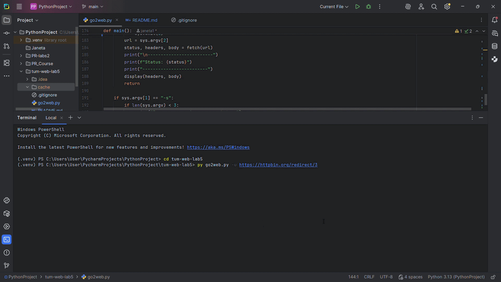

# Lab 5 - HTTP over TCP Sockets

A command-line HTTP client built from scratch over raw TCP sockets for a Web Programming lab at TUM. 
No `requests`, no `urllib.request`, no `http.client` — just Python's `socket` and `ssl` to handle 
everything from the TCP handshake to parsing raw HTTP responses.
## Usage
```bash
go2web -u <URL>            # make an HTTP request to the specified URL and print the response
go2web -s <search-term>    # search the term using DuckDuckGo and print top 10 results
go2web -h                  # show this help
```

## Features
- **`-u`** fetches any URL over raw TCP socket and prints human-readable output with HTML tags stripped
- **`-s`** searches DuckDuckGo and returns top 10 results with titles and URLs
- **`-h`** shows help
- **HTTPS** support via SSL socket wrapping
- **Redirects** - automatically follows 301, 302, 303, 307, 308 responses
- **Cache** - file-based cache with 1 hour TTL, responses stored per URL using MD5 hash
- **Content negotiation** - sends `Accept` header, detects `Content-Type` in response and handles both JSON (pretty printed) and HTML

## Requirements
- Python 3.6+
- beautifulsoup4 (`pip install beautifulsoup4`)

## Demo
### Basic usage - help, fetching HTML and JSON, request results saved to cache


### HTTP redirects and serving repeated requests from cache


### Search and opening results
